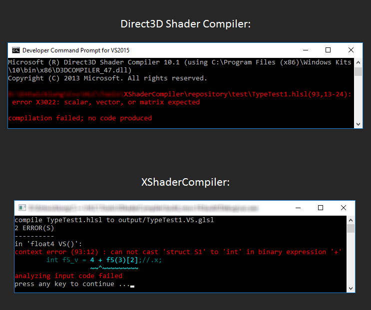

# XShaderCompiler ("Cross Shader Compiler") #

Features
--------

* Cross (or trans-) compiles HLSL shader code (Shader Model 4 and 5) into GLSL
* Simple to integrate into other projects
* Written in C++11

License
-------

3-Clause BSD License

Status
------

**Version: 0.02 Alpha** (*Do not use in production code!*)

##### Special Features: #####
* Low Overhead Translation (i.e. avoidance of unnecessary wrapper functions)
* Dead Code Removal
* Meaningful Report Output
* Commentary Preserving

##### TODO List: #####
* Common HLSL IO semantics to GLSL transformation.
* Geometry and Tessellation semantics.
* 'interface' and 'class' declarations.
* Cast expressions to a struct type is currently not supported (e.g. "(VertexOut)0").

Offline Compiler
----------------

The following command line translates the "Example.hlsl" file with the vertex shader entry point "VS", and the fragment shader entry point "PS":

```
xsc -E VS -T vert Example.hlsl -E PS -T frag Example.hlsl
```

The result are two GLSL shader files: "Example.VS.vert" and "Example.PS.frag".

Library Usage
-------------

```cpp
#include <Xsc/Xsc.h>
#include <fstream>

/* ... */

auto inputStream = std::make_shared<std::ifstream>("Example.hlsl");
std::ofstream outputStream("Example.vertex.glsl");

Xsc::ShaderInput inputDesc;
inputDesc.sourceCode     = inputStream;
inputDesc.shaderVersion  = Xsc::InputShaderVersion::HLSL5;
inputDesc.entryPoint     = "VS";
inputDesc.shaderTarget   = Xsc::ShaderTarget::VertexShader;

Xsc::ShaderOutput outputDesc;
outputDesc.sourceCode    = &outputStream;
outputDesc.shaderVersion = Xsc::OutputShaderVersion::GLSL330;

// Translate HLSL code into GLSL
Xsc::StdLog log;
bool result = Xsc::CompileShader(inputDesc, outputDesc, &log);
```

Output Example
--------------

<p align="center">Meaningful output messages with line marker:</p>
<p align="center"></p>

A few thoughts on translating HLSL
----------------------------------

Although HLSL lacks lots of features commonly seen in general purpose programming languages like C++ and Java,
HLSL is a very complex language, in both syntax and context!
The XShaderCompiler has to be prepared for a lot of weird corner cases, especially syntactically.
Take a look at the following example of an unnecessarily complex expression:
```hlsl
float f = ((vector<float, (1+4)/5+3>)1).w;
```
The XShaderCompiler is able to translate this to the follwing GLSL code:
```glsl
float f = (vec4(1)).w;
```
Many other features like structure inheritance (which does not seem to be documented in the HLSL manual pages)
must be translated to other constructs in GLSL, because GLSL is a more simpler language -- which pleases the compiler builder ;-).

Besides parsing a complex syntax, the XShaderCompiler tries to produce pretty output code which you'll love to maintain,
in contrast to most auto-generated code.
Consider the following simple HLSL vertex shader:
```hlsl
struct VertexIn
{
    float4 position : POSITION;
    float3 normal : NORMAL;
};

struct VertexOut
{
    float4 position : SV_Position;
    float3 normal : NORMAL;
};

VertexOut VertexMain(VertexIn inp)
{
    VertexOut outp;
    outp.position = inp.position;
    outp.normal = inp.normal;
    return outp;
}
```
Many shader cross compilers wrap the HLSL entry point into the GLSL 'main' function like this:
```glsl
#version 330

in vec4 position;
in vec3 normal;

out vec3 outp_normal;

struct VertexIn
{
    vec4 position;
    vec3 normal;
};

struct VertexOut
{
    vec4 position;
    vec3 normal;
};

VertexOut VertexMain(VertexIn inp)
{
    VertexOut outp;
    outp.position = inp.position;
    outp.normal = inp.normal;
    return outp;
}

void main()
{
    VertexIn inp;
    inp.position = position;
    inp.normal = normal;
    VertexOut outp = VertexMain(inp);
    gl_Position = outp.position;
    outp_normal = outp.normal;
}
```
The XShaderCompiler will automatically solve overlapping names and structures that are used as shader input or output,
so that unnecessary function wrappers are not required. This is what XShaderCompiler makes out of this:
```glsl
#version 330

in vec3 position;
in vec3 normal;

out VertexOut
{
    vec3 normal;
}
outp;

void main()
{
    gl_Position = position;
    outp.normal = normal;
}
```
