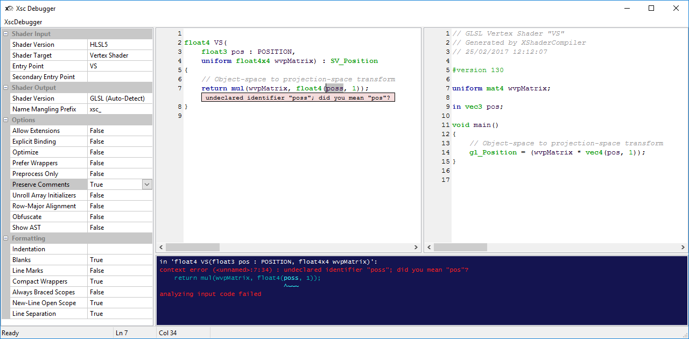

[](https://ci.appveyor.com/project/LukasBanana/xshadercompiler)

# XShaderCompiler ("Cross Shader Compiler") #

<p align="center"></p>

Features
--------

* Cross compiles HLSL shader code (Shader Model 4 and 5) into GLSL and Metal
* Simple to integrate into other projects
* Low overhead translation (i.e. avoidance of unnecessary wrapper functions)
* Dead code removal
* Code reflection
* Meaningful report output
* Commentary preserving
* Written in C++11

Language Bindings
-----------------

* C Wrapper (ISO C99)
* C# Wrapper

License
-------

3-Clause BSD License

Documentation
-------------

* [Getting Started with XShaderCompiler](https://github.com/LukasBanana/XShaderCompiler/blob/master/docu/GettingStarted/Getting%20Started%20with%20XShaderCompiler.pdf) (PDF)
* [XShaderCompiler Reference Manual](https://github.com/LukasBanana/XShaderCompiler/blob/master/docu/refman.pdf) (PDF)

Progress
--------

**Version: 0.11 Alpha** (*Do not use in production code!*)

See the [TODO.md](https://github.com/LukasBanana/XShaderCompiler/blob/master/TODO.md) file for more information.

| Feature | Progress | Remarks |
|---------|:--------:|---------|
| Vertex Shader | ~80% | Few language features are still left |
| Tessellation Control Shader | ~20% | InputPatch and patch-constant-function translation in progress |
| Tessellation Evaluation Shader | ~20% | OutputPatch translation in progress |
| Geometry Shader | ~60% | Code generation is incomplete |
| Fragment Shader | ~80% | Few language features are still left |
| Compute Shader | ~80% | Few language features are still left |

Offline Compiler
----------------

The following command line translates the `Example.hlsl` file with the vertex shader entry point `VS`, and the fragment shader entry point `PS`:
```
xsc -E VS -T vert Example.hlsl -E PS -T frag Example.hlsl
```
The result are two GLSL shader files: `Example.VS.vert` and `Example.PS.frag`.

The next command line translates the `Example.hlsl` file into one Metal shader:
```
xsc -Vout Metal Example.hlsl
```
The result is the `Example.metal` shader file.

Library Usage (C++)
-------------------

```cpp
#include <Xsc/Xsc.h>
#include <fstream>
#include <iostream>

int main()
{
    // Input file stream (use std::stringstream for in-code shaders).
    auto inputStream = std::make_shared<std::ifstream>("Example.hlsl");

    // Output file stream (GLSL vertex shader)
    std::ofstream outputStream("Example.VS.vert");

    // Fill the shader input descriptor structure
    Xsc::ShaderInput inputDesc;
    inputDesc.sourceCode     = inputStream;
    inputDesc.shaderVersion  = Xsc::InputShaderVersion::HLSL5;
    inputDesc.entryPoint     = "VS";
    inputDesc.shaderTarget   = Xsc::ShaderTarget::VertexShader;

    // Fill the shader output descriptor structure
    // Use outputDesc.options, outputDesc.formatting, and outputDesc.nameMangling for more settings
    Xsc::ShaderOutput outputDesc;
    outputDesc.sourceCode = &outputStream;

    // Optional output log (can also be a custom class)
    Xsc::StdLog log;

    // Optional shader reflection data (for shader code feedback)
    Xsc::Reflection::ReflectionData reflectData;

    // Translate HLSL code into GLSL
    try
    {
        bool result = Xsc::CompileShader(inputDesc, outputDesc, &log, &reflectData);
    }
    catch (const std::exception& e)
    {
        std::cerr << e.what() << std::endl;
    }

    return 0;
}
```

Library Usage (C#)
------------------

```cs
using System;
using System.IO;

namespace Example
{
    class Program
    {
        static void Main()
        {
            // Create instance of the XShaderCompiler
            var compiler = new XscCompiler();

            // Fill the shader input descriptor structure
            var inputDesc = new XscCompiler.ShaderInput();
            inputDesc.SourceCode     = File.ReadAllText("Example.hlsl");
            inputDesc.ShaderVersion  = XscCompiler.InputShaderVersion.HLSL5;
            inputDesc.EntryPoint     = "VS";
            inputDesc.Target         = XscCompiler.ShaderTarget.VertexShader;

            // Fill the shader output descriptor structure
            // Use outputDesc.Options, outputDesc.Formatting, and outputDesc.MameMangling for more settings
            var outputDesc = new XscCompiler.ShaderOutput();

            // Optional output log (can also be a custom class)
            var log = compiler.StandardLog;

            // Optional shader reflection data (for shader code feedback)
            var reflectData = new XscCompiler.ReflectionData();

            // Translate HLSL code into GLSL
            try
            {
                bool result = compiler.CompileShader(inputDesc, outputDesc, log, reflectData);

                if (result)
                {
                    // Write output shader code
                    File.WriteAllText("Example.VS.vert", outputDesc.SourceCode);
                }
            }
            catch (Exception e)
            {
                Console.WriteLine(e);
            }
        }
    }
}
```

Real-time Debugger
------------------

A real-time debugger with UI is provided. Although this debugger is mainly used for developement of the compiler itself,
it can also be used for a quick translation overview, to see how language constructs are being cross compiled.

<p align="center">Example of the real-time debugger (requires <a href="http://www.wxwidgets.org/">wxWidgets 3.1.0</a> or later):</p>
<p align="center"></p>

Language Differences
--------------------

Here is a brief outline of High-Level differences between HLSL and GLSL, which XShaderCompiler is able to translate properly:

| Feature | HLSL | GLSL | Metal |
|---------|:----:|:----:|:-----:|
| Texture/Sampler Separation | :heavy_check_mark: | Vulkan Only | :heavy_check_mark: |
| Structure Inheritance | :heavy_check_mark: | :heavy_multiplication_x: | :heavy_multiplication_x: |
| Nested Structures | :heavy_check_mark: | :heavy_multiplication_x: | :heavy_check_mark: |
| Anonymous Structures | :heavy_check_mark: | :heavy_multiplication_x: | :heavy_check_mark: |
| Structure Member Functions | :heavy_check_mark: | :heavy_multiplication_x: | :heavy_check_mark: |
| Default Parameters | :heavy_check_mark: | :heavy_multiplication_x: | :heavy_check_mark: |
| Object-Oriented Intrinsics | :heavy_check_mark: | :heavy_multiplication_x: | :heavy_check_mark: |
| Multiple Entry Points | :heavy_check_mark: | :heavy_multiplication_x: | :heavy_check_mark: |
| Type Aliasing | :heavy_check_mark: | :heavy_multiplication_x: | :heavy_check_mark: |
| L-Values of Input Semantics | :heavy_check_mark: | :heavy_multiplication_x: | :heavy_check_mark: |
| Implicit Type Conversion | Cyclic | Non-Cyclic | Cyclic
