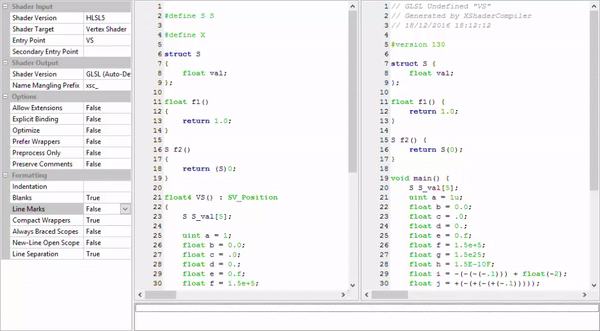

# XShaderCompiler ("Cross Shader Compiler") #

Features
--------

* Cross (or trans-) compiles HLSL shader code (Shader Model 4 and 5) into GLSL
* Simple to integrate into other projects
* Low overhead translation (i.e. avoidance of unnecessary wrapper functions)
* Dead code removal
* Meaningful report output
* Commentary preserving
* Written in C++11

License
-------

3-Clause BSD License

Documentation
-------------

- [Getting Started with XShaderCompiler](https://github.com/LukasBanana/XShaderCompiler/blob/master/docu/GettingStarted/Getting%20Started%20with%20XShaderCompiler.pdf) (PDF)
- [XShaderCompiler Reference Manual](https://github.com/LukasBanana/XShaderCompiler/blob/master/docu/refman.pdf) (PDF)

Progress
--------

**Version: 0.03 Alpha** (*Do not use in production code!*)

See the [TODO.md](https://github.com/LukasBanana/XShaderCompiler/blob/master/TODO.md) file for more information.

| Feature | Progress | Remarks |
|---------|:--------:|---------|
| Vertex Shader | ~80% | Few language features are still left |
| Tessellation Control Shader | ~20% | InputPatch and patch-constant-function translation in progress |
| Tessellation Evaluation Shader | ~20% | OutputPatch translation in progress |
| Geometry Shader | ~10% | Only parsing works |
| Fragment Shader | ~80% | Few language features are still left |
| Compute Shader | ~80% | Few language features are still left |

Offline Compiler
----------------

The following command line translates the "Example.hlsl" file with the vertex shader entry point "VS", and the fragment shader entry point "PS":

```
xsc -E VS -T vert Example.hlsl -E PS -T frag Example.hlsl
```

The result are two GLSL shader files: "Example.VS.vert" and "Example.PS.frag".

Library Usage
-------------

```cpp
#include <Xsc/Xsc.h>
#include <fstream>

int main()
{
    /* ... */

    // Input file stream (use std::stringstream for in-code shaders).
    auto inputStream = std::make_shared<std::ifstream>("Example.hlsl");

    // Output file stream (GLSL vertex shader)
    std::ofstream outputStream("Example.VS.vert");

    // Fill the shader input descriptor structure
    Xsc::ShaderInput inputDesc;
    inputDesc.sourceCode     = inputStream;
    inputDesc.shaderVersion  = Xsc::InputShaderVersion::HLSL5;
    inputDesc.entryPoint     = "VS";
    inputDesc.shaderTarget   = Xsc::ShaderTarget::VertexShader;

    // Fill the shader output descriptor structure
    // (Use 'outputDesc.options' and 'outputDesc.formatting' for more settings)
    Xsc::ShaderOutput outputDesc;
    outputDesc.sourceCode = &outputStream;

    // Optional output log (can also be a custom class)
    Xsc::StdLog log;

    // Optional shader reflection data (for shader code feedback)
    Xsc::Reflection::ReflectionData reflectData;

    // Translate HLSL code into GLSL
    bool result = Xsc::CompileShader(inputDesc, outputDesc, &log, &reflectData);
    
    /* ... */
    
    return 0;
}
```

Output Example
--------------

<p align="center">Meaningful output messages with line marker:</p>
<p align="center"></p>

Real-time Debugger
------------------

<p align="center">Example of the real-time debugger (requires <a href="http://www.wxwidgets.org/">wxWidgets 3.1.0</a> or later):</p>
<p align="center"></p>

A few thoughts on translating HLSL
----------------------------------

Although HLSL lacks lots of features commonly seen in general purpose programming languages like C++ and Java,
HLSL is a very complex language, in both syntax and context!
The XShaderCompiler has to be prepared for a lot of weird corner cases, especially syntactically.
Take a look at the following example of an unnecessarily complex expression:
```hlsl
float f = ((vector<float, (1+4)/5+3>)1).w;
```
The XShaderCompiler is able to translate this to the follwing GLSL code:
```glsl
float f = (vec4(1)).w;
```
Many other features like structure inheritance (which does not seem to be documented in the HLSL manual pages)
must be translated to other constructs in GLSL, because GLSL is a more simpler language -- which pleases the compiler builder ;-).

Besides parsing a complex syntax, the XShaderCompiler tries to produce pretty output code which you'll love to maintain,
in contrast to most auto-generated code.
Consider the following simple HLSL vertex shader:
```hlsl
struct VertexOut
{
    float4 position : SV_Position;
    float3 normal : NORMAL;
    float2 texCoord : TEXCOORD;
};

Texture2D colorMap : register(t0);
SamplerState linearSampler
{
    FILTER = MIN_MAG_MIN_LINEAR;
};

float4 PixelMain(VertexOut inp) : SV_Target
{
    // Sample color map
    float4 color = colorMap.Sample(linearSampler, inp.texCoord);
    
    // Perform alpha test
    clip(color.a - 0.5);
    
    // Simple shading
    float3 normal = normalize(inp.normal);
    float3 lightDir = float3(0, 0, -1);
    float NdotL = dot(normal, lightDir);
    
    // Pixel color output
    return color * NdotL;
}
```
Many shader cross compilers wrap the HLSL entry point into the GLSL 'main' function like and generate unecessary wrapper functions (e.g. for the "clip" intrinsic).
But XShaderCompiler will automatically resolve overlapping names and structures that are used as shader input or output,
so that unnecessary wrapper functions are not required. Even commentary preservation is supported. This is what XShaderCompiler makes out of this:
```glsl
// GLSL Fragment Shader "PixelMain"
// Generated by XShaderCompiler
// 28/12/2016 14:53:14

#version 130

in vec3 xsc_vary_NORMAL;
in vec2 xsc_vary_TEXCOORD;

out vec4 SV_Target0;

uniform sampler2D colorMap;

void main()
{
    // Sample color map
    vec4 color = texture(colorMap, xsc_vary_TEXCOORD);
    
    // Perform alpha test
    if (color.a < 0.5)
        discard;
    
    // Simple shading
    vec3 normal = normalize(xsc_vary_NORMAL);
    vec3 lightDir = vec3(0, 0, -1);
    float NdotL = dot(normal, lightDir);
    
    // Pixel color output
    SV_Target0 = color * NdotL;
}
```
